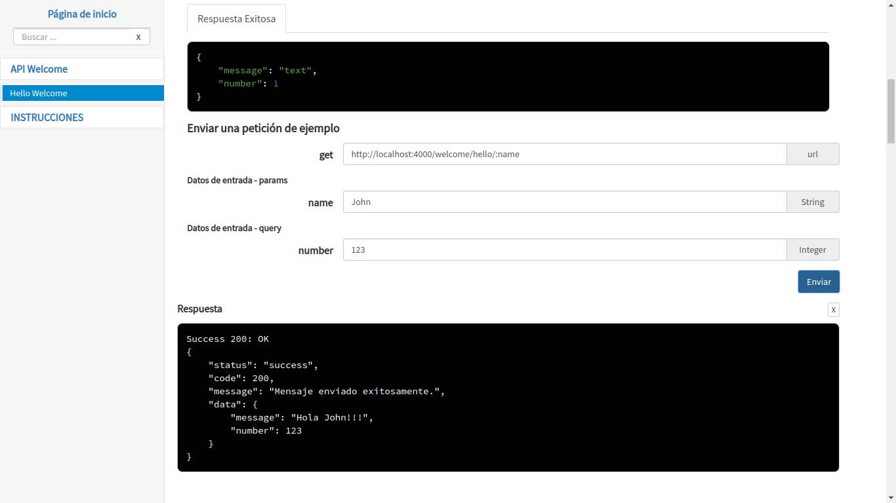

<h1 align="center">Framework de creación de servicios web</h1>

<p align="center">
  
</p>

<p align="center">
  <a href="https://github.com/insacjs/insac/releases">
      
  </a>

  <a href="https://npmcharts.com/compare/insac">
    
  </a>

  <a href="https://www.npmjs.com/package/insac">
    
  </a>

  <a href="https://opensource.org/licenses/MIT">
      
  </a>
</p>

Insac JS es un framework de creación de servicios web basado en lenguaje script que utiliza arquitectura REST. Está enfocado en la organización, automatización y reutilización de código.

La documentación se encuentra disponible en la página [https://insacjs.github.io](https://insacjs.github.io).

Para crear nuevos proyectos, utilice la [Interfaz de línea de comandos INSAC CLI](https://github.com/insacjs/insac-cli)

## Tecnologías utilizadas

El framework ha sido implementado utilizando el lenguaje JavaScript bajo el estándar de programación ECMAScript 2017, esto por el potencial que alcanzó el lenguaje gracias a NodeJS, un entorno de ejecución para JavaScript construido con el motor de JavaScript V8 de Chrome.

NodeJS permite crear aplicaciones del lado del servidor, además de que es una excelente herramienta para crear servicios web gracias a su modelo de operaciones E/S sin bloqueo orientado a eventos, que lo hace liviano y eficiente.

A continuación de describen las diferentes tecnologías y herramientas mas importantes con las que trabaja el framework:

| Nombre      | Versión  | Descripción                                                    |
| ----------- | -------- | -------------------------------------------------------------- |
| `NodeJS`    | ^8.0     | Entorno de programación de JavaScript.                         |
| `MPM`       | ^6.3     | Gestor de paquetes de NodeJS.                                  |
| `Express`   | ^4.16    | Framework de NodeJS.                                           |
| `Sequelize` | ^4.37    | Framework ORM de NodeJS.                                       |
| `Yarn`      | ^1.7     | Manejador de dependencias.                                     |
| `PM2`       | ^2.7     | Gestor avanzado de procesos de producción para NodeJS.         |
| `Git`       | ^2.7     | Sistema de control de versiones distribuido de código abierto. |
| `Eslint`    | ^4.19    | Herramienta de linting para JavaScript.                        |

## Soporta los siguientes gestores de base de datos:

| Nombre        | Versión  |
| ------------- | -------- |
| `PostgreSQL`  | ^9.4     |
| `MySQL`       | ^5.7     |
| `MSSQLSERVER` | 2017     |
| `SQLite`      | 3.24     |

## Características

Entre las características más importantes del framework se encuentran las siguientes:

- **Estructura de proyecto:** Utiliza un sistema que permite identificar a los componentes de la aplicación y sus respectivas funciones a través del nombre y la extensión de los ficheros.

- **Creación automática del APIDOC:** Crea el APIDOC de manera automática cada vez que se ejecuta la aplicación, de esta forma se garantiza que siempre estará actualizada.

- **Validador automático:** Valida los datos de entrada de forma automática, cuando los datos llegan al Middleware o al Controlador, éstos ya se encuentran validados y convertidos al tipo de dato correspondiente.

- **Sistema de filtrado de datos:** Por defecto, todas las peticiones incluyen un sistema de filtrado por campos, adicionalmente, es posible optimizar la consulta con la base de datos utilizando los filtros que se envían a través de la URL.

- **Esquemas de base de datos:** Sobre una base de datos, se crea un esquema para cada módulo, de esta forma es posible tener dos tablas o modelos con el mismo nombre, pero en diferentes módulos. Es posible relacionar modelos de diferentes módulos.

- **Sistema de logs:** Por defecto, se muestran mensajes en la terminal para monitorear todas las peticiones y éstas se registran en ficheros de logs.

## Referencias externas

- [Node JS](https://nodejs.org/es/)
- [NPM](https://www.npmjs.com/)
- [Express](http://expressjs.com/es/)
- [Sequelize](http://docs.sequelizejs.com/)
- [Yarn](https://yarnpkg.com/es-ES/)
- [PM2](http://pm2.keymetrics.io/)
- [GIT](https://git-scm.com/)
- [ESLint](https://eslint.org/)

## Ejemplo.-

Para preparar un proyecto básico, desde la terminal ejecuta los siguientes comandos:

```bash
# Crea la carpeta del proyecto
$ mkdir app
$ cd app

# Inicializa el gestor de paquetes de Node.
$ npm init

# Instala el framework
$ npm install --save insac
```

Posteriormente, deberá crear algunos archivos con la siguiente estructura:

```txt
app
  ├─ src
  │     └─ modules
  │           └─ API
  │                 ├─ resources
  │                 │     └─ welcome
  │                 │           ├─ welcome.controller.js
  │                 │           ├─ welcome.input.js
  │                 │           ├─ welcome.output.js
  │                 │           └─ welcome.route.js
  │                 └─ api.module.js
  ├─ node_modules
  ├─ index.js
  └─ package.json
```

Y el siguiente contenido:

### `api.module.js`
```js
const { Module } = require('insac')

module.exports = (app) => {
  return new Module(app.config.API)
}
```

### `welcome.route.js`
```js
module.exports = (app) => {
  const ROUTE = {}

  ROUTE.hello = {
    path   : '/welcome/hello/:name',
    method : 'get'
  }

  return ROUTE
}
```

### `welcome.input.js`
```js
const { Field } = require('insac')

module.exports = (app) => {
  const INPUT = {}

  INPUT.hello = {
    params: {
      name: Field.STRING({ allowNull: false })
    },
    query: {
      number: Field.INTEGER({ allowNull: false })
    }
  }

  return INPUT
}
```

### `welcome.output.js`
```js
const { Field } = require('insac')

module.exports = (app) => {
  const OUTPUT = {}

  OUTPUT.hello = {
    message : Field.STRING(),
    number  : Field.INTEGER()
  }

  return OUTPUT
}
```

### `welcome.controller.js`
```js
module.exports = (app) => {
  const CONTROLLER = {}

  CONTROLLER.hello = async (req, res, next) => {
    try {
      const NAME   = req.params.name
      const NUMBER = req.query.number
      const RESULT = { message: `Hola ${NAME}!!!`, number: NUMBER }
      res.success200(RESULT, 'Mensaje enviado exitosamente.')
    } catch (err) { return next(err) }
  }

  return CONTROLLER
}
```

### `index.js`
```js
const { Insac } = require('insac')

const service = new Insac()

service.addModule('api')

service.init().catch(e => {
  console.log(e)
  process.exit(1)
})

module.exports = service
```

Después, ejecuta la aplicación:

```bash
$ node index.js
```

### `http://localhost:4000`


### `http://localhost:4000/apidoc/API`


### Petición de ejemplo



### Mensajes de logs


